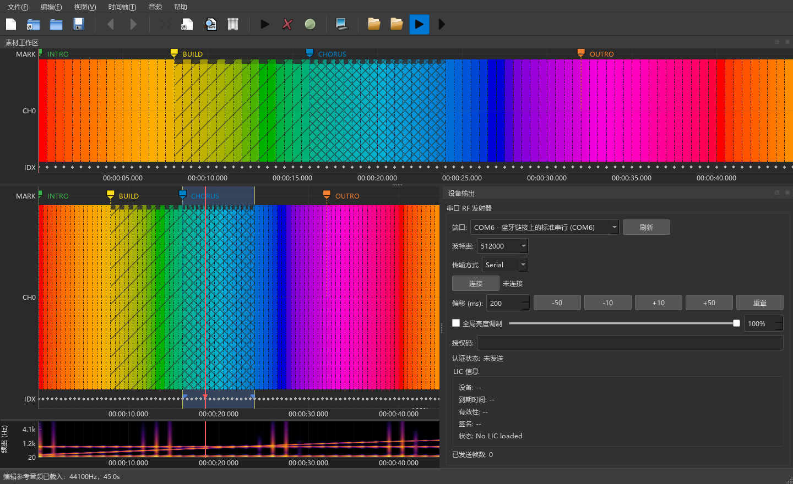

<p align="center">
  
</p>

<h1 align="center">LumaFlow</h1>

<p align="center">LED 灯光序列编排工具，让颜色、节拍与时间轴同步。</p>
<p align="center">A desktop timeline editor for LED light sequences.</p>

<p align="center">
  <a href="CHANGELOG.md"></a>
  <a href="LICENSE"></a>
  
  <a href="https://github.com/ltyridium/LumaFlow/actions/workflows/ci.yml"></a>
</p>

<p align="center">
  <a href="#安装指南">安装</a> ·
  <a href="#快速开始">快速开始</a> ·
  <a href="CHANGELOG.md">更新日志</a> ·
  <a href="CONTRIBUTING.md">参与贡献</a> ·
  <a href="https://github.com/ltyridium/LumaFlow/issues">问题反馈</a>
</p>



双工作区编排、可选通道显示、参考音视频同步，以及串口 / BLE / UDP 设备输出。上图使用程序生成的演示灯光数据，设备未连接。

当前源码版本为 **1.9.0**。便携包请查看 [GitHub Releases](https://github.com/ltyridium/LumaFlow/releases)，源码更新与二进制包发布相互独立。

---

## 目录

- [项目概述](#项目概述)
- [功能特性](#功能特性)
- [系统要求](#系统要求)
- [安装指南](#安装指南)
- [快速开始](#快速开始)
- [用户界面](#用户界面)
- [快捷键参考](#快捷键参考)
- [数据格式](#数据格式)
- [光效生成](#光效生成)
- [音频可视化](#音频可视化)
- [设备输出](#设备输出)
- [版本说明](#版本说明)
- [开发与验证](#开发与验证)
- [许可与样本数据](#许可与样本数据)
- [架构设计](#架构设计)

---

## 项目概述

LumaFlow 是一款专为 LED 灯光效果设计的时间轴编辑器。它支持：

- **10通道数据编辑**：每个通道具有独立的 RGB 颜色（4位，0-15）和功能模式；当前设备仅 CH0 有效，时间轴默认只显示 CH0
- **参考媒体同步**：支持视频及 MP3、WAV、FLAC、M4A 等音频文件与灯光时间轴同步
- **音频波形显示**：可视化音频频谱，辅助灯光节拍同步
- **双工作区系统**：素材工作区（只读参考）+ 编辑工作区（灯光序列编排）
- **完整的撤销/重做系统**：所有编辑操作均可撤销
- **CSV 数据格式**：易于导入导出的开放格式
- **发射器输出**：支持 USB 串口、BLE 和局域网 UDP

---

## 功能特性

### 核心编辑功能
- 剪切、复制、粘贴、删除帧数据
- 插入黑屏帧、彩色帧
- 添加和编辑时间标记
- 区域偏移（时间平移）
- 选区批量设置颜色、亮度和灯光功能
- 生成呼吸效果和彩虹流光效果

### 时间轴功能
- 高性能渲染，支持海量帧数据
- 智能数据聚合（缩小视图时自动降采样）
- 帧吸附功能（自动对齐到最近关键帧）
- 区域选择和编辑
- 标记系统（可双击编辑）
- 常亮、1Hz、2Hz、4Hz 使用不同纹理显示，缩放聚合后仍保留闪烁特征

### 参考媒体与音频
- 双参考媒体播放器（素材参考 + 编辑参考）
- VLC 播放器集成
- 支持常见视频格式以及 MP3、WAV、FLAC、M4A、AAC、OGG、Opus 等音频格式
- 音频频谱可视化（Mel 频谱图）
- 参考媒体与时间轴同步播放
- 视频播放结束后保留最终画面，并支持继续播放或拖动跳转
- 音频解析完成后保持当前时间轴视图，不打断编辑位置

### 界面特性
- 可停靠面板系统（参考 Adobe Premiere Pro 布局）
- 深色/浅色主题切换
- 窗口状态保存与恢复
- 可恢复上次关闭时打开的灯光序列和参考媒体
- 数据表格查看器

---

## 系统要求

### 必需组件
- Python 3.10+
- VLC Media Player（系统安装）
- FFmpeg（启动检查必需，用于参考媒体音频提取；须加入 PATH）
- Windows 10/11 64 位（Windows 便携包）

### Python 依赖
```
PySide6>=6.5.0
pandas>=2.0.0
numpy>=1.24.0
pyserial>=3.5
bleak>=0.22.0
python-vlc>=3.0.0
pyqtgraph==0.13.7
numba>=0.57.0
librosa>=0.10.0
soundfile>=0.12.0
matplotlib>=3.7.0
requests>=2.28.0
Pillow>=9.5.0
psutil>=7.0.0
```

---

## 安装指南

### 1. 安装 VLC Media Player
从 [VLC 官网](https://www.videolan.org/vlc/) 下载并安装 VLC。

### 2. 安装 FFmpeg
安装 FFmpeg 并将其 `bin` 目录加入 PATH。重新打开终端后，确认 `ffmpeg -version` 可执行。

### 3. 安装 Python 依赖
```bash
cd LumaFlow
python -m pip install -r requirements.txt
```

### 4. 运行应用程序
```bash
python main.py
```

---

## 快速开始

### 创建新项目
1. 点击 **文件 → 在编辑工作区中新建灯光序列...** 或按 `Ctrl+N`
2. 输入项目时长（秒）
3. 开始编辑

### 打开现有项目
1. 点击 **文件 → 打开灯光序列到编辑工作区...** 或按 `Ctrl+O`
2. 选择 CSV 文件

### 导入参考素材
1. 点击 **文件 → 打开灯光序列到素材工作区...** 加载只读参考 CSV
2. 点击 **打开参考媒体到素材工作区...** 或 **打开参考媒体到编辑工作区...**，选择视频或音频文件

### 基本编辑流程
1. 在时间轴上点击定位播放头
2. 拖动创建选区
3. 使用快捷键或菜单执行编辑操作
4. `Ctrl+S` 保存

---

## 用户界面

### 主窗口布局

```
┌─────────────────────────────────────────────────────────────────┐
│  菜单栏  │  文件  编辑  视图  时间轴  音频                       │
├─────────────────────────────────────────────────────────────────┤
│  工具栏  │ 新建 打开 保存 │ 撤销 重做 │ 剪切 复制 粘贴 │ ...   │
├──────────────────┬──────────────────────────────────────────────┤
│                  │                                              │
│  素材参考媒体    │                   素材工作区                   │
│                  │                                              │
├──────────────────┼──────────────────────────────────────────────┤
│                  │                                              │
│  编辑参考媒体    │                   编辑工作区                   │
│                  │                                              │
├──────────────────┴──────────────────────────────────────────────┤
│                        数据表格视图                              │
└─────────────────────────────────────────────────────────────────┘
```

### 时间轴视图

- **CH0-CH9**：10个 LED 通道，显示颜色块；默认仅显示 CH0
- **MARK**：标记通道，显示时间标记
- **IDX**：索引通道，显示播放头和选区指示器

可在 **视图 → 显示通道...** 打开紧凑的多选窗口，一次勾选多个通道，也可使用“全选”或“仅 CH0”。通道选择会同时作用于素材和编辑时间轴，并在下次启动时恢复；至少保留一个可见通道。隐藏操作不会修改 CSV 数据或设备输出。

当前设备仅 CH0 有效；CH1-CH9 保留用于数据查看和编辑，显示这些通道不代表设备支持输出。

- **红色竖线**：播放头位置
- **蓝色区域**：选中区域

### 可停靠面板
- **素材工作区**：只读灯光素材时间轴（默认隐藏）
- **素材参考媒体**：素材工作区对应的媒体播放器（默认隐藏）
- **编辑参考媒体**：编辑工作区对应的媒体播放器
- **数据表**：选区数据表格视图

通过 **视图** 菜单可以显示/隐藏各个面板。

---

## 快捷键参考

> 说明：以下为当前代码实现（`ui/main_window.py`、`ui/timeline_widget.py`、`ui/video_player_widget.py`）的实际行为。  
> 未特别标注时，默认作用于**编辑时间轴（Edit Timeline）**。  
> **源时间轴（Source Timeline）**主要支持导航/缩放、`Ctrl+C` 复制、`J` 跳转鼠标位置、空格播放控制（经主窗口转发）。

### 文件操作
| 快捷键 | 功能 |
|--------|------|
| `Ctrl+N` | 在编辑工作区中新建灯光序列 |
| `Ctrl+O` | 打开灯光序列到编辑工作区 |
| `Ctrl+S` | 保存编辑工作区灯光序列 |
| `Ctrl+Shift+S` | 编辑工作区灯光序列另存为 |
| `Ctrl+Q` | 退出程序（Qt 标准 Quit） |

### 编辑操作
| 快捷键 | 功能 |
|--------|------|
| `Ctrl+Z` | 撤销 |
| `Ctrl+Y` / `Ctrl+Shift+Z` | 重做 |
| `Ctrl+X` | 剪切选区 |
| `Ctrl+C` | 复制选区 |
| `Ctrl+V` | 粘贴到播放头位置 |
| `Delete` | 删除选区 |
| `Ctrl+A` | 全选 |
| `Ctrl+Shift+D` | 取消选择 |

> 注：`Ctrl+X` / `Ctrl+V` / `Delete` / `Ctrl+A` / `Ctrl+Shift+D` 仅编辑时间轴可用；源时间轴不支持这些编辑操作。

### 时间轴导航
| 快捷键 | 功能 |
|--------|------|
| `←` / `→` | 移动播放头 ±10ms |
| `Shift+←` / `Shift+→` | 移动播放头 ±100ms |
| `Alt+←` / `Alt+→` | 跳转到上/下一个标记 |
| `Home` | 跳转到时间轴起点 |
| `End` | 跳转到时间轴终点 |
| `Page Up` / `Page Down` | 移动半个视图宽度 |
| `J` | 跳转到鼠标位置 |

### 视图缩放
| 快捷键 | 功能 |
|--------|------|
| `+` / `=` | 放大 |
| `-` | 缩小 |
| `F` | 适应当前选区 |
| `\` | 适应全部数据到视图 |
| `滚轮` | 水平滚动 |
| `Shift+滚轮` | 水平滚动（快速） |
| `Ctrl+滚轮` | 以鼠标位置为中心缩放 |
| `Alt+滚轮` | 音频轨道垂直缩放 |

> 注：`\` 当前仅编辑时间轴可用；`F` 通过主窗口动作触发，按鼠标所在时间轴进行适配。

### 插入操作
| 快捷键 | 功能 |
|--------|------|
| `B` | 插入黑屏帧 |
| `W` | 插入白色帧 |
| `R` | 插入红色帧 |
| `G` | 插入绿色帧 |
| `I` | 插入自定义颜色帧（弹出对话框） |
| `M` | 添加标记（弹出对话框） |
| `E` | 编辑当前帧（±50ms 内最近的帧） |

> 注：以上插入/编辑快捷键当前按实现主要用于编辑时间轴。

### 选区批量编辑
| 快捷键 | 功能 |
|--------|------|
| `Ctrl+1` | 将选区内全部灯光帧设为常亮 |
| `Ctrl+2` | 将选区内全部灯光帧设为 1Hz 慢闪 |
| `Ctrl+3` | 将选区内全部灯光帧设为 2Hz 快闪 |
| `Ctrl+4` | 将选区内全部灯光帧设为 4Hz 爆闪 |
| `Ctrl+Up` | 选区亮度提高 10% |
| `Ctrl+Down` | 选区亮度降低 10% |

“时间轴”菜单和编辑工作区右键菜单还提供“设置选区颜色”和自定义亮度比例。批量操作保留时间戳、标记和未修改字段，并作为一次操作撤销或重做。

### 区域偏移
| 快捷键 | 功能 |
|--------|------|
| `Shift+M` | 指定偏移量对话框 |
| `Ctrl+[` | 选区左移 100ms |
| `Ctrl+]` | 选区右移 100ms |

> 注：区域偏移仅编辑时间轴可用。

### 播放控制
| 快捷键 | 功能 |
|--------|------|
| `空格` | 播放/暂停当前焦点时间轴对应的参考媒体 |
| `F11` | 视频窗口全屏切换（视频预览控件聚焦时） |
| `Esc` | 退出视频全屏 |

### 鼠标操作
| 操作 | 功能 |
|------|------|
| 左键点击 | 定位播放头 |
| 左键拖动 | 创建选区 |
| Shift+左键 | 扩展选区 |
| Ctrl+左键拖动（选区内） | 偏移选区数据 |
| 中键拖动 | 平移视图 |
| 右键点击 | 上下文菜单 |
| 双击标记 | 编辑标记名称 |
| 媒体区域单击 | 播放/暂停参考媒体 |
| 视频区域双击 | 全屏切换（纯音频不适用） |

---

## 数据格式

### CSV 文件结构

LumaFlow 使用 CSV 格式存储灯光序列数据：

| 列名 | 类型 | 描述 |
|------|------|------|
| `frame_time_ms` | float | 帧时间戳（毫秒） |
| `frame_id` | int | 顺序帧编号 |
| `frame_type` | string | 帧类型（blackout, color, breathing, rainbow 等） |
| `marker` | string | 可选的时间标记名称 |
| `ch{N}_function` | int | 通道 N 的功能码（0-3） |
| `ch{N}_red` | int | 通道 N 的红色值（0-15） |
| `ch{N}_green` | int | 通道 N 的绿色值（0-15） |
| `ch{N}_blue` | int | 通道 N 的蓝色值（0-15） |

其中 `N` 为通道编号 0-9。

### 功能码说明
| 功能码 | 描述 |
|--------|------|
| 0 | 常亮（静态颜色） |
| 1 | 1Hz 频闪 |
| 2 | 2Hz 频闪 |
| 3 | 4Hz 频闪 |

### 颜色值
- 取值范围：0-15（4位）
- 实际 RGB 值：乘以 17 得到 0-255 范围
- 例如：`r=15, g=8, b=0` → RGB(255, 136, 0)

---

## 光效生成

### 呼吸效果（Breathing Effect）

通过 **时间轴 → 生成 → 生成呼吸效果** 打开对话框。

参数：
- **Duration (ms)**：效果总时长
- **Interval (ms)**：帧间隔（默认 100ms）
- **Color**：基础颜色
- **Min Brightness**：最小亮度（0.0-1.0）
- **Max Brightness**：最大亮度（0.0-1.0）

呼吸效果使用正弦波调制亮度，产生渐变效果。

### 彩虹流光效果（Rainbow Effect）

通过 **时间轴 → 生成 → 生成彩虹效果** 打开对话框。

参数：
- **Duration (ms)**：效果总时长
- **Interval (ms)**：帧间隔（默认 100ms）
- **Speed**：颜色变化速度

彩虹效果在 HSV 色彩空间中循环变换，10个通道呈现相位偏移的彩虹效果。

---

## 音频可视化

### 概述

LumaFlow 可以直接读取音频文件，或从视频中提取音频并显示 Mel 频谱图，帮助您将灯光效果与音乐节拍同步。

### 启用音频可视化

1. 导入视频或音频参考媒体
2. 音频将自动读取或从视频中提取并处理
3. 频谱图显示在时间轴下方

纯音频文件会隐藏视频画面和全屏按钮，保留播放、暂停、定位、音量及时间轴同步。素材和编辑工作区可以同时使用同一媒体文件。具体格式能否解码取决于本机 VLC 和 FFmpeg，不包含受 DRM 保护的媒体。

### 音频设置

通过 **音频 → 音频可视化设置...** 打开设置对话框。

可配置项：
- **声道模式**：单声道、立体声、左声道、右声道
- **频率范围**：最低/最高频率（Hz）
- **色彩映射**：频谱显示的配色方案
- **显示高度**：音频轨道的高度

### 技术参数

- **采样率**：44100 Hz
- **FFT 窗口**：2048 samples
- **跳跃长度**：1024 samples
- **Mel 频带数**：128
- **默认频率范围**：20-8000 Hz

---

## 设备输出

通过 **视图 → 设备输出** 打开发射器控制面板。支持以下传输方式：

| 方式 | 适用场景 | 说明 |
|------|----------|------|
| Serial | 固定控制台、调试 | USB 直连，优先推荐 |
| BLE | 近距离无线控制 | 扫描并选择名称以 `LumaFlow` 开头的设备；源码环境需要 `bleak` |
| UDP | 同一局域网远距离布置 | IP 单独输入，端口固定为 `32712` |

- 授权码（AUTH LIC）为可选：**留空则跳过认证直接连接**，适用于不校验授权的发射器（如 11C3）；填写后每次“连接”都会发送授权数据，断开重连会重新认证，格式非法或已过期会显示“配置错误”并中止连接。
- UDP 需要发射器侧已启用局域网功能；若发射器固件关闭了网络，请改用 Serial 或 BLE。
- UDP STREAM 可设置 `1-4` 次轻量重复发送，提高偶发丢包环境下的可靠性。下位机负责过滤重复 STREAM，避免重复发送 433MHz 空口帧。
- “全局亮度调制”只在输出阶段缩放 RGB，不修改灯光序列文件，也不改变 function。
- BLE 扫描失败时，先确认当前环境已安装 `bleak`，再检查 Windows 蓝牙、设备占用和距离。
- BLE、UDP 和串口只负责编辑器到发射器的控制链路；发射器到荧光棒仍使用 433MHz，需要单独完成天线覆盖测试。
- 控制链路的传输参数、TLV 帧格式、授权帧与历史 22 字节驱动协议见 [`docs/device-output-protocol.md`](docs/device-output-protocol.md)。

---

## 版本说明

### 1.9.0

- 参考素材导入扩展为常见视频与音频媒体，支持 MP3、WAV、FLAC、M4A、AAC、OGG、Opus 等格式。
- 时间轴默认聚焦 CH0，并支持通过独立多选窗口同时显示任意 CH0-CH9 通道。
- 压缩 MARK 和 IDX 辅助轨道，将更多垂直空间用于颜色通道。
- 修复纯数字 marker 列无法写入文本标记的问题，并过滤旧文件中的 `0`、`null` 等空标记占位值。
- 修复聚合渲染尾帧未延伸至下一真实关键帧的问题。
- 修复同一参考媒体用于两个工作区时频谱仅更新一侧的问题，以及全屏视频切换为音频后残留全屏窗口和旧定时回调的问题。

### 1.8.0

- 增强 BLE、UDP 和串口连接稳定性，完善认证、断开重连和 UDP 重复发送。
- 增加输出全局亮度调制。
- 增加选区批量设置 function、亮度和颜色，并支持撤销/重做。
- 增强闪烁纹理、浅色主题和聚合视图辨识度。
- 增加上次工作区恢复，修复视频结束后无法继续播放、预览重开黑屏和音频分析改变视图等问题。
- 便携包文件名统一包含版本和平台，并打包 BLE 运行依赖。

完整变更记录见 [CHANGELOG.md](CHANGELOG.md)。

---

## 开发与验证

在项目根目录运行完整测试（PowerShell）：

```powershell
$env:QT_QPA_PLATFORM = "offscreen"
python -m unittest discover -s tests -p "*test*.py"
Remove-Item Env:QT_QPA_PLATFORM
```

测试同时包含 `*_test.py` 和 `test_*.py` 两种命名，不能仅使用其中一种模式。v1.9.0 在 2026-09-08 通过全部 155 项测试，并使用真实 MP3/MP4 验证 FFmpeg 解码和 Mel 频谱计算。VLC 加载、定位、播放及全屏媒体切换另在 Qt `minimal` 后端下完成静音检查；`offscreen` 用于单元测试和截图，不作为原生播放器验收环境。

上述检查不代替灯光设备实机联调或 Windows 便携包验收；源码版本更新不代表已上传新的安装包。

GitHub Actions 在 Windows 上运行 Python 3.10 / 3.12 测试，徽章显示实际执行状态。开发环境、贡献流程和打包步骤见 [CONTRIBUTING.md](CONTRIBUTING.md)，漏洞报告见 [SECURITY.md](SECURITY.md)。

---

## 架构设计

### 整体架构

LumaFlow 采用 MVC 风格的架构：

```
┌─────────────┐     ┌─────────────┐     ┌─────────────┐
│    main.py  │────▶│  app_logic  │────▶│   managers  │
│   (入口)    │     │  (控制器)   │     │  (业务逻辑) │
└─────────────┘     └──────┬──────┘     └─────────────┘
                           │
                    ┌──────▼──────┐
                    │  MainWindow │
                    │    (UI)     │
                    └─────────────┘
```

### 核心模块

#### `app_logic.py` - 应用控制器
- 连接 UI 和业务逻辑
- 处理所有用户操作
- 协调各个 Manager

#### `core/data_manager.py` - 数据管理器
- CSV 文件加载和保存
- 时间轴数据操作（粘贴、删除、分段）
- 数据完整性验证

#### `core/undo_manager.py` - 撤销管理器
- 命令模式实现
- 支持剪切、粘贴、删除、偏移、插帧、标记、帧编辑，以及选区 function、亮度和颜色批量操作

#### `core/effects.py` - 光效生成器
- 呼吸效果生成
- 彩虹效果生成
- 使用 Numba JIT 加速

#### `core/audio_manager.py` - 音频管理器
- 音频提取（通过 FFmpeg）
- Mel 频谱图计算（通过 librosa）
- 瓦片缓存系统

#### `core/clipboard_manager.py` - 剪贴板管理器
- 存储复制/剪切的帧数据
- 跟踪数据来源（source/edit）

### UI 模块

#### `ui/main_window.py` - 主窗口
- 菜单栏和工具栏
- Dock 布局管理
- 信号连接

#### `ui/timeline_widget.py` - 时间轴组件
- 基于 PyQtGraph 的高性能渲染
- 自定义图形项（FastScatterItem, MarkerItem 等）
- 后台渲染线程

#### `ui/timeline_tools.py` - 时间轴工具
- 工具状态机模式
- SelectionTool：选择和编辑
- HandTool：平移视图

#### `ui/dialogs.py` - 对话框
- EffectDialog：光效参数配置
- ColorPickerDialog：颜色选择器

#### `ui/video_player_widget.py` - 参考媒体播放器
- VLC 播放器封装
- 播放控制
- 时间同步

#### `ui/audio_track_widget.py` - 音频轨道
- 频谱图显示
- 与时间轴同步缩放

### 性能优化

- **后台渲染**：时间轴渲染在独立线程执行
- **数据聚合**：缩小视图时自动降采样，保持帧率
- **瓦片缓存**：音频频谱图分块缓存
- **Numba JIT**：光效生成使用 JIT 编译加速
- **批量操作**：数据操作使用向量化 Pandas 操作

---

## 主题

LumaFlow 支持深色和浅色两种主题：

- **深色主题**：通过 **视图 → Dark Theme** 启用
- **浅色主题**：通过 **视图 → Light Theme** 启用

主题文件位于 `resources/styles/` 目录。


## 问题反馈

通过 [GitHub Issues](https://github.com/ltyridium/LumaFlow/issues) 提交问题，并附上版本、复现步骤和必要截图。请不要上传私人媒体、访问凭据或无权分发的样本。

## 许可与样本数据

**应用代码**采用 [GNU GPLv3](LICENSE) 许可；代码的使用、修改和分发以该许可证为准，不附加“禁止商用”限制。

**参考样本**（`resources/CSVfile/` 下的 CSV 文件）仅用于技术研究、学习和数据渲染验证，不在应用代码的 GPLv3 许可范围内，也不代表任何实际商业演出的完整技术方案。样本数据不得用于商业用途，其中涉及的原创编排设计归原权利人所有；如权利人认为使用不当，请联系维护者移除。

Code is licensed under GPLv3. Reference CSV samples are provided for non-commercial research and testing only and are not covered by the code license.
